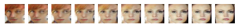

## basicGAN: literally a basic GAN

*this small project is being developed using the excellent tutorial at*
### [this link!](https://machinelearningmastery.com/how-to-interpolate-and-perform-vector-arithmetic-with-faces-using-a-generative-adversarial-network/)

------------------------------------------------------------------------------------------------

i am hoping to teach myself a little more about how to develop GANs from scratch,
as well as gain some proficiency in manipulating trained GAN latent spaces to create art.

-------------------------------------------------------------
#### instructions:
0. set up an appropriate python environment using conda; 'env-details.txt' helpfully has instructions for this.
1. really, this is mostly just a copy of the code used in the above-linked tutorial, with a few of my extra quirks added, such as the ability to render out every single frame of training. so the first step is to start reading that tutorial..
2. the file 'dataset_prep.ipynb' comprises the 'How to Prepare CelebA Faces Dataset' section of the tutorial. it will compile and output a large dataset file to be used in the GAN itself. see below for a note and download link for the dataset itself.
3. the file 'basicGAN.ipynb' comprises the 'How to Develop a Generative Adversarial Network' section of the tutorial. it is the GAN itself! you can look at this notebook file to read my notes or just dive right into basicGAN.py if that suits you.
4. finally, the point of this exercise was to explore the latent space. the files 'latent_nav1.ipynb' and 'latent_walk.py' comprise the 'How to Interpolate Between Generated Faces' section of the tutorial. as above, the notebook file includes my notes and should be somewhat helpful.latent_walk.py is a nifty little script that generates animation frames for random 'walks' through a trained latent space arising from basicGAN. by default it will loop back to its origin, so you can make looping GAN gifs! i recommend the lovely applet ScreenToGif.exe, available [here](https://www.screentogif.com/), for compiling animated gif images, as well as the stolid [ffmpeg](https://ffmpeg.org/download.html) for making longer movies.

cheers and stay tuned! i have much more interesting stuff in the works :alien:

**functional notes:**
- unfortunately, this basic tutorial uses the CelebA dataset. the thorny issue of consent-based dataset making is somewhat sidestepped by using photos of celebrities, who seem to be content with their fate. you can download it [here](http://mmlab.ie.cuhk.edu.hk/projects/CelebA.html).

- the image_prep script uses a facial recognition implementation by Iván de Paz Centeno:
https://github.com/ipazc/mtcnn